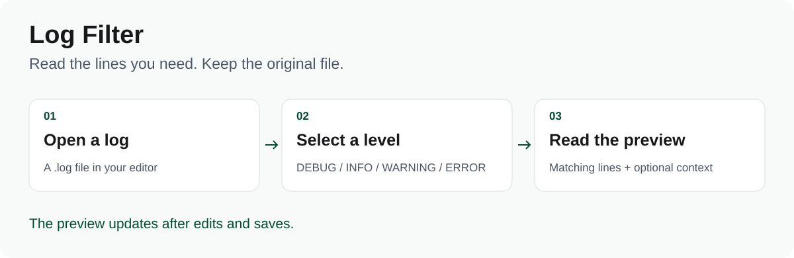
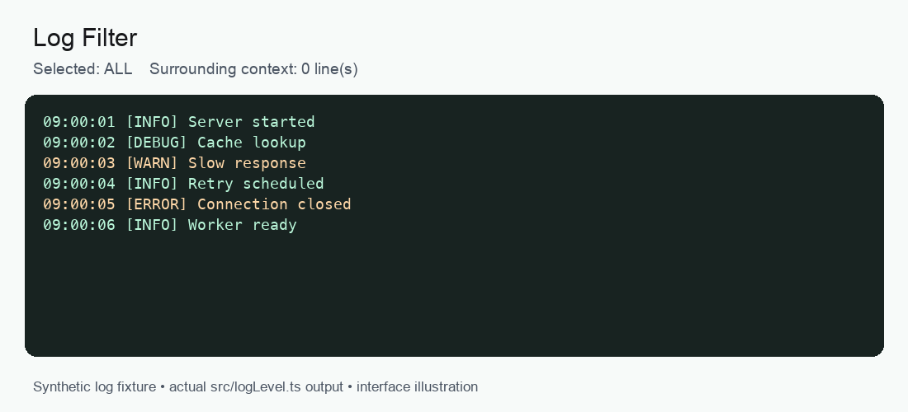

# Log Filter for VS Code

Filter a `.log` file by level and read the matching lines in a separate editor tab. The original file stays unchanged.



**VS Code 1.85+ · DEBUG / INFO / WARNING / ERROR · MIT**

## See the filter



*Behavior illustration generated with the real filter function; this is not a recording of the VS Code interface. [Static example](docs/media/filter.png).*

## Install from source

```bash
git clone https://github.com/MaciejZet/LOGGER-ext.git
cd LOGGER-ext
npm ci
npm run compile
npx @vscode/vsce package
```

In VS Code, open the Command Palette, choose **Extensions: Install from VSIX…**, and select the generated `.vsix` file.

## Use it

1. Open a `.log` file, or set the editor language to **Log**.
2. Open **Log Filter → Level filter** in the activity bar.
3. Select a level. A preview tab shows the matching lines.
4. Add surrounding context when needed; choose **ALL** to see the complete file.

The preview refreshes after edits and saves. You can search and copy its text like a normal editor document. The command **Log Filter: Open filtered view** reuses the last selected level.

## Matching rules

| Filter | Recognized words, case-insensitive |
| --- | --- |
| DEBUG | `DEBUG` |
| INFO | `INFO` |
| WARNING | `WARNING`, `WARN` |
| ERROR | `ERROR`, `ERR`, `CRITICAL`, `FATAL` |

Matching uses whole words, including forms such as `[INFO]` and `level=DEBUG`. If a line contains several level words, the first matching rule in the order above wins. This is text matching, not a structured-log parser.

## Develop

```bash
npm run check
npm run compile
```

Press **F5** in VS Code to launch the Extension Development Host. Filter logic lives in [src/logLevel.ts](src/logLevel.ts); the panel and preview providers live alongside it.

[MIT license](LICENSE)
